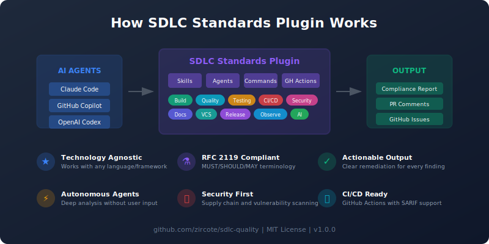

# sdlc

[](https://github.com/zircote/sdlc-quality/actions/workflows/ci.yml)
[](LICENSE)
[](.claude-plugin/plugin.json)
[](https://github.com/zircote/sdlc-quality)

[](https://github.com/anthropics/claude-code)
[](https://github.com/features/copilot)
[](https://openai.com/blog/openai-codex)
[](docs/GITHUB_ACTIONS.md)

Software Development Lifecycle standards and requirements plugin for AI coding assistants.

> **Plugin Name**: `sdlc`

<p align="center">
  
</p>

## Overview

This plugin provides comprehensive SDLC standards guidance that works with **any AI coding assistant** (Claude, Gemini, Codex, Copilot, OpenCode, etc.). It codifies project quality requirements across the entire software development lifecycle.

## Features

- **Technology-agnostic**: Standards apply to any language/framework
- **Self-contained**: Full guidance works without external dependencies
- **RFC 2119 compliant**: Uses MUST/SHOULD/MAY terminology
- **AI-first design**: Structured for AI assistant consumption
- **Comprehensive coverage**: Build, quality, testing, CI/CD, security, docs, VCS, release
- **Autonomous agents**: Deep analysis without constant user input
- **Actionable output**: Clear remediation steps for every finding

## Installation

### Claude Code

```bash
# Install from GitHub
claude plugins add github:zircote/sdlc-quality

# Or install from local path
claude plugins add /path/to/sdlc-quality

# Verify installation
claude plugins list
```

## Quick Start

### Check Your Project

```bash
# Run comprehensive compliance check
/sdlc:check
```

**Output:**

```
SDLC Compliance Report

| Domain   | Status | Issues |
|----------|--------|--------|
| Build    | ✓      | 0      |
| Quality  | ✓      | 0      |
| Testing  | ✗      | 2      |
| CI/CD    | ✓      | 0      |
| Security | ✗      | 1      |
| Docs     | ✓      | 0      |
| VCS      | ✓      | 0      |

Critical: Missing test coverage configuration
Important: SECURITY.md needs update
```

### Initialize a New Project

```bash
# Create SDLC-compliant project structure
/sdlc:init
```

**Creates:**

- `Makefile` with standard targets
- `README.md`, `CONTRIBUTING.md`, `CHANGELOG.md`
- `LICENSE`, `SECURITY.md`
- `.github/workflows/ci.yml`
- Issue and PR templates
- ADR directory structure

## Skills

Skills provide contextual guidance when you ask related questions.

| Skill                | Purpose                     | Triggers                                            |
| -------------------- | --------------------------- | --------------------------------------------------- |
| `sdlc:build`         | Build system automation     | "Makefile", "build targets", "dependencies"         |
| `sdlc:quality`       | Code formatting, linting    | "linter", "formatter", "code style"                 |
| `sdlc:testing`       | Test organization, coverage | "tests", "coverage", "TDD"                          |
| `sdlc:ci`            | CI/CD pipeline structure    | "GitHub Actions", "CI pipeline", "workflow"         |
| `sdlc:security`      | Dependency scanning         | "vulnerabilities", "security audit", "supply chain" |
| `sdlc:docs`          | Documentation requirements  | "README", "changelog", "ADR"                        |
| `sdlc:vcs`           | Version control practices   | "git", "branching", "commits"                       |
| `sdlc:release`       | Semantic versioning         | "release", "versioning", "publish"                  |
| `sdlc:observability` | Logging, metrics            | "logging", "metrics", "performance"                 |
| `sdlc:ai`            | AI context configuration    | "CLAUDE.md", "copilot-instructions"                 |
| `sdlc:setup`         | Project initialization      | "new project", "setup", "scaffold"                  |

## Agents (Claude Code only)

Specialized agents for autonomous, deep analysis:

| Agent                | Purpose             | When to Use                               |
| -------------------- | ------------------- | ----------------------------------------- |
| `compliance-auditor` | Full SDLC audit     | Pre-release, periodic reviews             |
| `security-reviewer`  | Security analysis   | Security assessments, supply chain audits |
| `quality-enforcer`   | Code quality checks | Pre-PR, quality gates                     |
| `ci-architect`       | CI/CD design        | Pipeline setup, optimization              |

**Example:**

```
User: Run a full compliance audit on this project
Claude: [Launches compliance-auditor agent for autonomous analysis]
```

## Commands (Claude Code only)

| Command       | Purpose                                       |
| ------------- | --------------------------------------------- |
| `/sdlc:check` | Assess current project against SDLC standards |
| `/sdlc:init`  | Initialize a new SDLC-compliant project       |

## GitHub Actions Integration

Run SDLC compliance checks in your CI/CD pipeline.

### Option 1: Composite Action (Recommended)

```yaml
name: SDLC Compliance

on: [pull_request, push]

permissions:
  contents: read
  pull-requests: write

jobs:
  compliance:
    runs-on: ubuntu-latest
    steps:
      - uses: actions/checkout@v4

      - name: Run SDLC Check
        uses: zircote/sdlc-quality/.github/actions/sdlc-check@v1
        with:
          domains: "all"
          fail-on-error: "true"
          create-pr-comment: "true"
```

### Option 2: Reusable Workflow

```yaml
name: SDLC Audit

on:
  pull_request:
  schedule:
    - cron: "0 9 * * 1"

jobs:
  audit:
    uses: zircote/sdlc-quality/.github/workflows/sdlc-audit.yml@v1
    with:
      domains: "all"
      fail-on-error: true
      create-pr-comment: true
    permissions:
      contents: read
      pull-requests: write
      issues: write
```

**Features:**

- Composite action for easy integration
- Reusable workflow for full audit capabilities
- Multiple trigger modes: PR, push, schedule, issue assignment
- Report formats: Markdown, JSON, SARIF (GitHub Security tab)
- Automatic PR comments with results
- Issue creation for compliance failures

See [GitHub Actions Integration](docs/GITHUB_ACTIONS.md) for complete documentation.

## AI Agent Interoperability

This plugin is designed to work with multiple AI coding assistants:

| Agent          | Configuration                                                |
| -------------- | ------------------------------------------------------------ |
| Claude Code    | `.claude-plugin/`, skills, agents, commands                  |
| GitHub Copilot | `.github/copilot-instructions.md`, `copilot-setup-steps.yml` |
| OpenAI Codex   | `AGENTS.md`                                                  |

All agents follow the same SDLC standards and can be used interchangeably.

## Documentation

| Document                                             | Purpose                               |
| ---------------------------------------------------- | ------------------------------------- |
| [Project Requirements](docs/PROJECT_REQUIREMENTS.md) | Complete SDLC standards specification |
| [GitHub Actions](docs/GITHUB_ACTIONS.md)             | CI/CD integration guide               |
| [Architecture](docs/ARCHITECTURE.md)                 | Plugin design and structure           |
| [Usage Guide](docs/USAGE.md)                         | Detailed usage instructions           |
| [Contributing](CONTRIBUTING.md)                      | How to contribute                     |
| [Changelog](CHANGELOG.md)                            | Version history                       |

## Standards Covered

The plugin enforces standards across these domains:

### Build System

- Unified entry point (Makefile/Justfile)
- Standard targets (build, test, lint, format, ci)
- Locked dependencies
- MSV (Minimum Supported Version)

### Code Quality

- Automated formatting
- Strict linting
- Error handling patterns
- Documentation comments

### Testing

- Test organization
- Coverage requirements (80% general, 95% critical)
- Deterministic tests
- AAA pattern

### CI/CD

- Required jobs (format, lint, test, security)
- Pinned action versions
- Caching
- Multi-platform

### Security

- Vulnerability scanning
- License compliance
- Supply chain security
- Secret scanning

### Documentation

- README with required sections
- CONTRIBUTING.md
- CHANGELOG.md (Keep a Changelog)
- ADRs

### Version Control

- Branch protection
- Conventional Commits
- PR templates
- Linear history

### Release

- Semantic Versioning
- Automated releases
- Checksums
- Multi-channel distribution

## Technology Examples

Each skill includes implementation examples for:

- **Rust** (Cargo, clippy, rustfmt)
- **TypeScript** (npm, ESLint, Prettier)
- **Python** (pip, ruff, black)
- **Java** (Maven/Gradle, Checkstyle)
- **Go** (go mod, golangci-lint)

## Contributing

See [CONTRIBUTING.md](CONTRIBUTING.md) for guidelines.

### Quick Contribution

```bash
# Clone
git clone https://github.com/zircote/sdlc-quality.git

# Install locally
claude plugins add ./sdlc-quality

# Test changes
/sdlc:check
```

## License

[MIT](LICENSE)

## Support

- **Issues**: [GitHub Issues](https://github.com/zircote/sdlc-quality/issues)
- **Discussions**: [GitHub Discussions](https://github.com/zircote/sdlc-quality/discussions)
